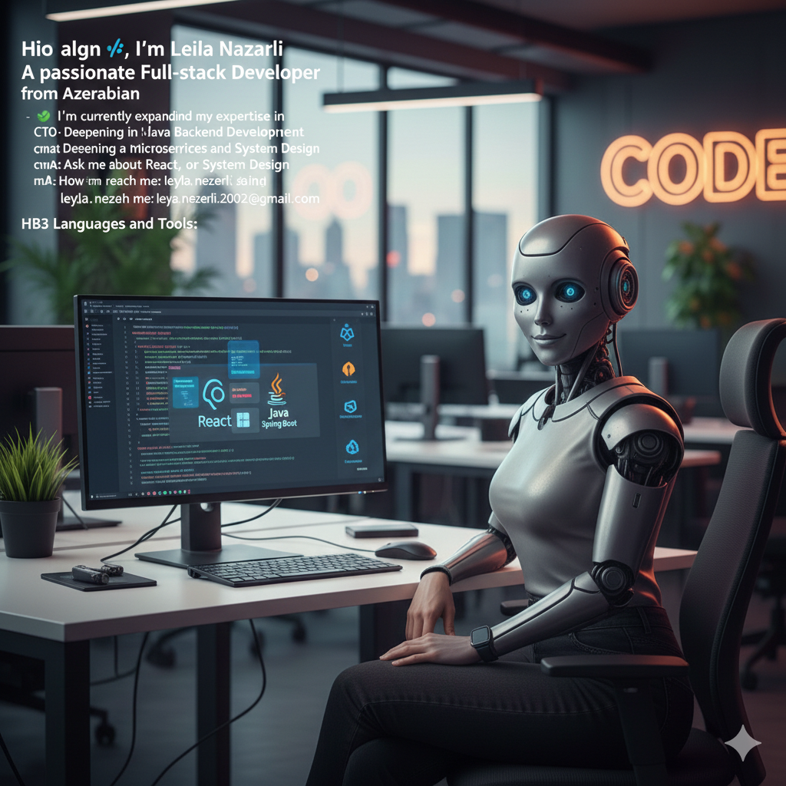

<h1 align="center">Hi 👋, I'm Leila Nazarli</h1>
<h3 align="center">Passionate Full-stack Developer from Azerbaijan</h3>

  

---

### 🚀 About Me
- 🌱 I’m currently deep diving into **Java Backend Development**.
- 🛠️ Mastering microservices with **Spring Boot, Redis, and RabbitMQ**.
- 🐳 Building scalable environments using **Docker**.
- 💬 Ask me about **React, Java, or System Design**.
- 📫 Reach me at: **leyla.nezerli.2002@gmail.com**

---

### 🛠 Languages and Tools

#### 🎨 Frontend Development

  
  
  
  
  
  

#### ⚙️ Backend & Infrastructure

  
  
  
  
  
  
  

#### 🔧 Design & Others

  
  
  

---

### 🤝 Connect with me:

 

  

